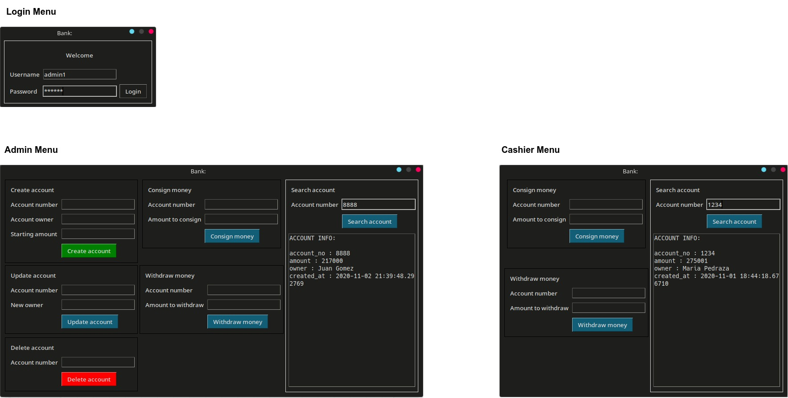
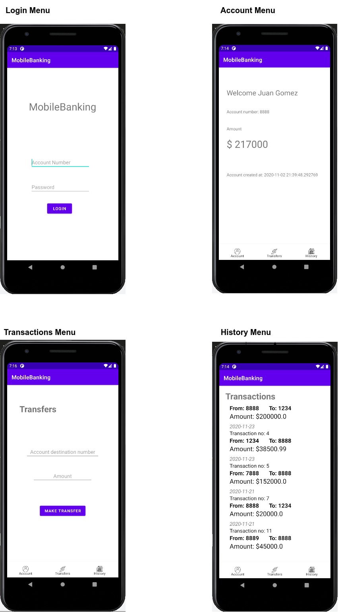

# Distributed Bank
Distributed Bank project that connects a desktop and mobile application using remote objects and REST API.

### Desktop Application
This project is a desktop application that simulates the transactions of a bank branch, the actions are based in roles and permissions. 

Each office is independent and send the reports to the central server using Python Remote Objects(Pyro).

For practical purposes the central database it's in SQLite 

### Mobile Application
In the other hand the mobile banking is a mobile application in Kotlin that consume a REST API (using JWT) that are connected with the central server.
 
The API it's written in Python to make possible connect with the Pyro Object in the central server.

